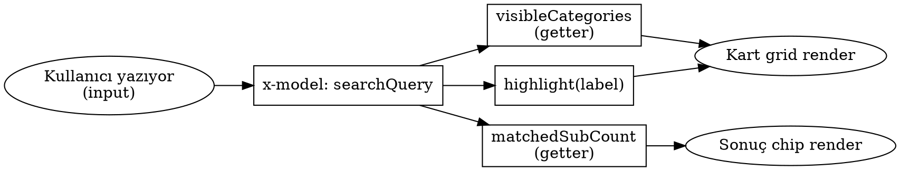

# FAQ Search & Sidebar Buttons — Design Spec

**Tarih:** 2026-05-11
**Kapsam:** `pages/help/faq.html` (Yardım Merkezi SSS sayfası)
**Etkilenen dosyalar:**

- `src/components/help-center/FAQPageLayout.ts`
- `src/alpine/help.ts` (Alpine.data("faqPage"))
- `src/i18n/locales/tr.ts`
- `src/i18n/locales/en.ts`

> **Yapılmayacaklar (out of scope):** CSS dosyasına ekleme yok (kural 0.1: utility-only). Yeni dosya/komponent açılmaz. `faq-detail.html` sayfası bu spec dışında. Sidebar görsel kimliği değişmez (sadece kod refactor'u).

---

## 1. Problem Tespiti

Mevcut FAQ sayfasında (`FAQPageLayout.ts`):

1. **Inline `style` kullanımı (CLAUDE.md kuralı 4.3 ihlali):**
   - Submit butonu: `style="background:var(--color-primary-500)"`
   - Sidebar aktif state: `style="background:var(--color-primary-500);border:none;"`
2. **Alpine V3 ihlali (CLAUDE.md kuralı 5.2.1):** Root `<div>` üzerinde `x-init="init()"` — V3'te `init()` otomatik çalışır, manuel çağrı yasak.
3. **i18n eksik:** Input placeholder hardcoded İngilizce: `"Enter question or keyword. Example: Payment"`. Sayfa Türkçe locale'de bile İngilizce kalıyor.
4. **Search UX eksiklikleri:**
   - Input'un dikey padding'i yok → görsel olarak buton ile hizasız
   - Container `rounded` (4px) — modern UX ile tutarsız
   - Focus feedback yok (border veya ring değişmiyor)
   - Clear (X) butonu yok — kullanıcı queryyi tek tıkla silemez
   - Sonuç sayacı yok — kaç eşleşme bulunduğu görünmüyor
   - Eşleşen metin vurgulanmıyor — kullanıcı kelimeyi kart altında kolay göremiyor

---

## 2. Kabul Kriterleri

Implementation aşağıdakileri sağladığında "tamam" sayılır:

1. `grep -E 'style="(background|border)' src/components/help-center/FAQPageLayout.ts` boş döner.
2. `grep 'x-init="init()"' src/components/help-center/FAQPageLayout.ts` boş döner.
3. Türkçe locale'de input placeholder Türkçe görünür.
4. Input'a metin yazınca sağda X butonu belirir; tıklandığında query temizlenir ve odak input'a döner.
5. Search query boş değilken sonuç chip'i görünür ve formatı `{kategoriSayısı} kategori, {soruSayısı} soru bulundu` (Türkçe).
6. Eşleşen kelime, kart altındaki link metninde primary-100 arka plan ve primary-700 renk ile `<mark>` içinde gösterilir. Case-insensitive eşleşme.
7. Container focus-within'de border primary-500'e döner ve 2px ring belirir.
8. Sidebar görselinde fark yoktur (pixel-diff ihmal edilebilir).
9. `npm run lint` ve `npm run build` hatasız geçer.

---

## 3. Search Bar — Anatomi

### 3.1 Container

```
flex items-center h-12 bg-white rounded-lg border border-gray-300 shadow-sm
overflow-hidden max-w-[600px] mx-auto transition-all
focus-within:border-[var(--color-primary-500,#f5b800)]
focus-within:ring-2 focus-within:ring-[var(--color-primary-500,#f5b800)]/20
focus-within:shadow-md
```

- Sabit yükseklik `h-12` (48px) — alt elemanların `h-full` ile dolduracağı standart.
- `rounded-lg` (8px) — projedeki diğer modern inputlarla uyumlu.
- `focus-within` ile container tek seferde stillenir; iç elemanlarda outline kapalı kalır.

### 3.2 Leading icon wrapper (yeni)

```
pl-4 pr-2 text-gray-400 flex items-center shrink-0
```

- 16px magnifier SVG, sadece dekoratif (`aria-hidden="true"`).
- Submit butonundaki magnifier'ı çıkarmıyoruz; submit'in görselliği yön oku (→) yerine yine magnifier kalacak (semantik: "ara"). Leading icon hint için.

### 3.3 Input

```
flex-1 min-w-0 px-2 text-sm text-gray-700 outline-none placeholder-gray-400
bg-transparent
```

- `min-w-0` shrink overflow'u önler.
- Placeholder i18n key: `helpCenter.faqSearchPlaceholder` (Türkçe: "Soru veya anahtar kelime girin. Örn: Ödeme").
- `aria-label`: `helpCenter.faqSearchAriaLabel` (Türkçe: "Sıkça sorulan sorularda ara").

### 3.4 Clear button (yeni)

```html
<button
  type="button"
  x-show="searchQuery"
  x-cloak
  @click="clearSearch()"
  :aria-label="t('helpCenter.faqClearSearch')"
  class="px-2 text-gray-400 hover:text-gray-600 transition-colors shrink-0
         flex items-center justify-center h-full"
>
  <!-- X icon, w-4 h-4 -->
</button>
```

- `x-cloak` ile FOUC önlenir (zaten projede `[x-cloak]{display:none!important}` tanımlı).
- `clearSearch()` Alpine metodu:
  ```ts
  clearSearch() {
    this.searchQuery = "";
    const input = this.$root.querySelector<HTMLInputElement>("#faq-search-input");
    input?.focus();
  }
  ```

### 3.5 Submit button

```
w-12 h-full bg-[var(--color-primary-500,#f5b800)]
hover:bg-[var(--color-primary-600,#d39c00)]
text-white transition-colors shrink-0
flex items-center justify-center
```

- Sabit `w-12` (48px) → kare buton, h-12 container içinde simetrik.
- Magnifier SVG `w-4 h-4` kalır.

---

## 4. Sonuç Chip'i + Vurgu

### 4.1 Chip

Search bar'ın hemen altında, container'ın `</div>` kapanışından sonra:

```html
<div x-show="searchQuery.trim()" x-cloak class="max-w-[600px] mx-auto mt-3 text-center">
  <span class="inline-flex items-center gap-2 px-3 py-1 rounded-full
               bg-[var(--color-primary-50,#fff8e1)]
               text-[var(--color-primary-700,#a87c00)] text-xs">
    <span x-text="resultsLabel"></span>
  </span>
</div>
```

`resultsLabel` getter:

```ts
get resultsLabel(): string {
  const catCount = this.visibleCategories.length;
  const subCount = this.matchedSubCount;
  // i18n key: helpCenter.faqResultsFound = "{cats} kategori, {subs} soru bulundu"
  return t("helpCenter.faqResultsFound", { cats: catCount, subs: subCount });
}

get matchedSubCount(): number {
  const q = this.searchQuery.trim().toLowerCase();
  if (!q) return 0;
  return this.visibleCategories.reduce((sum: number, c: any) => {
    return sum + c.subs.filter((s: any) => s.label.toLowerCase().includes(q)).length;
  }, 0);
}
```

> i18next interpolasyonu projede zaten kullanılıyor (i18next ^25 native destekli).

### 4.2 Eşleşme vurgusu

Mevcut `x-text="sub.label"` kullanan link, `x-html` ile değiştirilir:

```html
<a
  :href="'faq-detail.html?cat=' + cat.id + '&sub=' + (sub.key || '')"
  class="text-[12px] transition-colors"
  :class="sub.highlight ? 'text-[var(--color-primary-500,#f5b800)] hover:text-[var(--color-primary-700,#a87c00)]' : 'text-gray-600 hover:text-[var(--color-primary-500,#f5b800)]'"
  x-html="highlight(sub.label)"
></a>
```

Alpine helper'ları (`faqPage` data objesine eklenecek):

```ts
escapeHtml(s: string): string {
  return s.replace(/[&<>"']/g, (ch) => ({
    "&": "&amp;", "<": "&lt;", ">": "&gt;", '"': "&quot;", "'": "&#39;",
  }[ch] as string));
},

escapeRegex(s: string): string {
  return s.replace(/[.*+?^${}()|[\]\\]/g, "\\$&");
},

highlight(text: string): string {
  const q = this.searchQuery.trim();
  const escaped = this.escapeHtml(text);
  if (!q) return escaped;
  const re = new RegExp(`(${this.escapeRegex(q)})`, "gi");
  return escaped.replace(
    re,
    '<mark class="bg-[var(--color-primary-100,#ffefb3)] text-[var(--color-primary-700,#a87c00)] rounded-sm px-0.5">$1</mark>',
  );
}
```

**Güvenlik notu:** Label kaynakları `t(...)` çağrılarından geliyor (yani trusted locale dosyaları). Query escape edildiği için `<mark>` içine kullanıcı HTML'i kaçmaz. DOMPurify gereksiz, ancak `escapeHtml` mutlaka label'a da uygulanır (locale değerlerinde HTML karakteri olma ihtimaline karşı).

> **Aynı kategori vurgu kuralı:** Kart başlığındaki `<h3 x-text="cat.label">` da `x-html="highlight(cat.label)"` olarak güncellenir (kategori adıyla eşleşme arandığında başlık da vurgulanır).

---

## 5. Sidebar Buttons — Refactor

**Şu anki kod (FAQPageLayout.ts:50-62):**

```html
:class="activeCategory === cat.id
  ? 'font-bold text-white'
  : 'text-gray-700 bg-white hover:bg-gray-50 border-b border-gray-100'"
:style="activeCategory === cat.id ? 'background:var(--color-primary-500);border:none;' : ''"
```

**Yeni:**

```html
:class="activeCategory === cat.id
  ? 'font-bold text-white bg-[var(--color-primary-500,#f5b800)] border-b border-transparent'
  : 'text-gray-700 bg-white hover:bg-gray-50 border-b border-gray-100'"
```

- `:style` direktifi tamamen kaldırılır.
- Aktif state'te `border-b border-transparent` kullanılır ki yükseklik kayması olmasın (passive state `border-b border-gray-100` ile aynı kalınlık).

---

## 6. V3 / i18n Temizliği

### 6.1 V3 fix

`FAQPageLayout.ts:14` satırından `x-init="init()"` kaldırılır. `Alpine.data("faqPage")` zaten `init()` metoduna sahip → otomatik çağrılır.

### 6.2 Yeni i18n key'leri

`src/i18n/locales/tr.ts` → `helpCenter` bloğuna eklenir:

```ts
faqSearchPlaceholder: "Soru veya anahtar kelime girin. Örn: Ödeme",
faqSearchAriaLabel: "Sıkça sorulan sorularda ara",
faqClearSearch: "Aramayı temizle",
faqResultsFound: "{{cats}} kategori, {{subs}} soru bulundu",
```

`src/i18n/locales/en.ts` → aynı bloğa:

```ts
faqSearchPlaceholder: "Enter question or keyword. Example: Payment",
faqSearchAriaLabel: "Search frequently asked questions",
faqClearSearch: "Clear search",
faqResultsFound: "{{cats}} categories, {{subs}} questions found",
```

> i18next interpolation sözdizimi `{{...}}` (çift süslü), `{...}` değil. Tasarım metnindeki örnek format `{cats}` görsel temsildir; gerçek key'de `{{cats}}` olacak.

### 6.3 Template'teki `t(...)` çağrıları

`FAQPageLayout.ts` zaten `import { t } from "../../i18n"` kullanıyor. Yeni key'ler aynı `t(...)` üzerinden render edilecek.

`t` zaten `src/alpine/help.ts:2`'de import edilmiş (`import { t } from "../i18n"`) ve `faqPage` data'sı boyunca kullanılıyor. Yeni getter/metotlar (`resultsLabel`, `clearSearch` `aria-label`'ı için gerekirse) doğrudan `t(...)` çağırır.

- Template (`FAQPageLayout.ts`) içindeki static metinler: render zamanı `${t("helpCenter.faqXxx")}` interpolasyonu (mevcut pattern — örn. `${t("helpCenter.faqNoResults")}`).
- Alpine getter/metot içinden çağrılar: `t("helpCenter.faqResultsFound", { cats, subs })` — i18next interpolation native destekli.

---

## 7. Data Flow



- `clearSearch()` → `searchQuery = ""` → yukarıdaki tüm türevler sıfırlanır, X butonu kaybolur, chip kaybolur, vurgu kaybolur.
- Kategori sidebar butonu tıklanırsa `selectCategory(id)` zaten `searchQuery = ""` yapıyor — aynı zincir tetiklenir.

---

## 8. Test Planı

Manuel (dev server'da `npm run dev` ile):

1. **Türkçe locale:** `/pages/help/faq.html` aç. Placeholder Türkçe görünmeli.
2. **English locale:** Türkçe selector'dan dil değiştir. Placeholder İngilizce'ye dönmeli.
3. **Live filter:** "ödeme" yaz. Grid filtrelensin, chip'te `... kategori, ... soru bulundu` görünsün, eşleşen kelime alt linklerde sarı (primary-100) zeminle vurgulansın.
4. **Clear butonu:** Yazarken sağda X belirsin. Tıkla → input temizlensin, focus input'a dönsün, chip kaybolsun.
5. **Focus feedback:** Input'a tıkla. Container kenarlığı primary-500'e dönsün, halka belirsin.
6. **Sidebar aktif state:** Bir kategoriye tıkla. Mevcut sarı zemin + beyaz font görünümü korunmalı.
7. **V3 doğrulama:** Console'da Alpine warning olmamalı.
8. **Lint:** `npm run lint` → 0 hata.
9. **Build:** `npm run build` → başarılı.
10. **XSS guardrails:** Searchbox'a `<script>alert(1)</script>` yaz. Hiçbir alert tetiklenmemeli; metin escape edilmiş halde vurgu olmadan görünebilir (hiçbir kategori eşleşmez, normal).

---

## 9. Riskler & Kararlar

| Risk | Karar |
|---|---|
| `x-html` XSS riski | Label trusted (locale), query escape ediliyor. DOMPurify gerekmiyor. |
| `t(...)` Alpine getter içinden çağrılırsa locale değişiminde re-evaluate olmayabilir | Locale değişimi sayfa reload tetikliyor (i18n init pattern'i). Sorun değil. |
| `border-b border-transparent` yükseklik kayması | `border-gray-100` ile aynı 1px → kayma yok. |
| Sonuç chip'i `min-h` yokluğunda layout shift yapar | `x-show` + `x-cloak` ile initial hidden; yazıldığı an görünür. Mt-3 ile sabit boşluk. |
| `matchedSubCount` query boşken N kart × M sub iterasyon israfı | Erken return `if (!q) return 0` ile O(1). |

---

## 10. Sonraki Adım

Bu spec onaylandıktan sonra `writing-plans` skill'i ile detaylı implementation plan (TDD aşamaları, dosya başına diff bloğu, doğrulama komutları) yazılacak.
